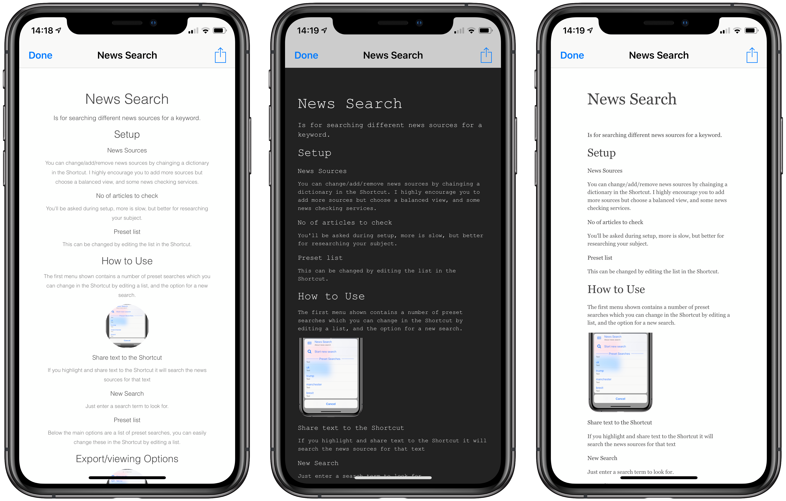
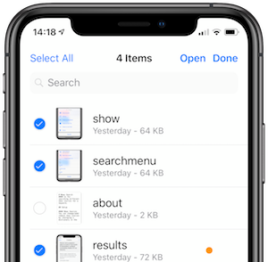

# Markdown To
#### For applying CSS to a Markdown File and embedding images

Example of one Markdown file with several different CSS styles.

## Choose Markdown File
You can share to the Shortcut, if there is anything on the Clippboard you will be offered the choice of using the Clipboard, or to use a File. If the Clipboard is empty you will be asked for a file.

- The title should be on the first line otherwise the Shortcut might not deal with it properly.

- Inline images named should be without any path.

## Title
You will be asked for a filename for the finished html, the Shortcut will fill it in with the Markdown title from the document.

## CSS
Next you'll be asked for the css file to apply to the Markdown document. The Shortcut expects css files to be in the Folder MarkdownCSS, if the folder is empty the Shortcut offers to install 4 x CSS styles.

## Attach Images
You can include any images used in the Markdown as Base 64 images. The filename should be the same as the Markdown inline image name.

To select multiple images, use Select, then choose Open once finished.

## Exporting
There are 2 options for exporting, as a html file or as raw html, which between them will cover all the export options you should need.
eg You use html file if you want to convert to pdf, raw html for copying to the Clipboard.

